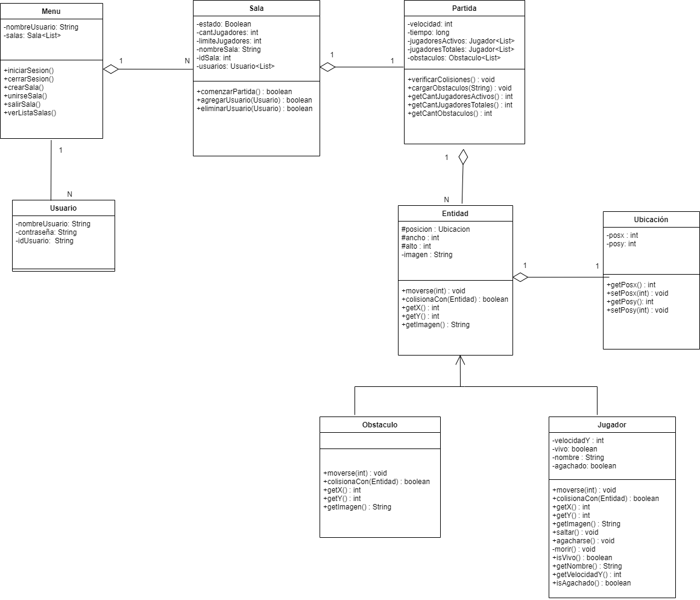

# Juego: Estoico

El jugador: “Estoico” deberá recorrer la mayor distancia posible esquivando obstáculos.

La finalidad del juego es conseguir el mayor tiempo de partida posible sin colisionar con un
obstáculo. Al colisionar, muere.

Todos en una misma pantalla, aparecen más obstáculos y no se permitirá la colisión entre
jugadores.

Se agregará dificultad a medida que vaya recorriendo el mapa, aumentando la velocidad del
jugador.
# TheExceptions
Diagrama de clases:

